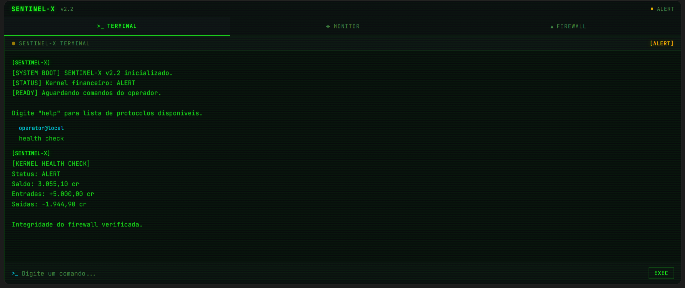

# SENTINEL-X: Financial Defense System 🛡️

## 1. Descrição do Projeto 📁
O **SENTINEL-X** é um sistema conceitual de organização de finanças pessoais desenvolvido sob a metodologia de **Vibe Coding**. Diferente de aplicativos tradicionais baseados em planilhas e formulários, o SENTINEL-X utiliza uma interface de conversação baseada em linguagem natural, inspirada na estética Cyberpunk e em terminais de segurança cibernética.

O sistema trata a economia do usuário como a manutenção da integridade de um servidor crítico: gastos excessivos são registrados como ameaças ao sistema (intrusões), enquanto o atingimento de metas é visualizado como upgrades de hardware e expansão de módulos.

## 2. Resultado Final no Lovable 🚀
Abaixo, você pode conferir a interface do terminal de comando do SENTINEL-X em operação, demonstrando a estética de alto contraste e a resposta do sistema em tempo real:

## 3. Processo de Criação (Vibe Coding) 🧠
O desenvolvimento deste projeto seguiu três etapas principais de interação com IA:

1. **Definição de Contexto:** Estabelecimento da identidade visual high-tech, unindo conceitos de Cibersegurança com gestão financeira pessoal para reduzir a fricção no registro de dados.
2. **Engenharia de Prompt (PRD):** Elaboração de um Documento de Requisitos de Produto detalhado, instruindo a IA a atuar como um arquiteto de sistemas e designer de interface focada em UX.
3. **Refinamento Iterativo:** Ajustes no comportamento da persona para garantir um tom de voz técnico e vigilante, priorizando o **Design Universal** para garantir que a interface seja legível e operável por qualquer usuário.

## 4. Principais Funcionalidades ⚙️
- **Direct Command Input:** Registro de transações via chat simulando comandos de console (ex: `log: café 10cr`).
- **Configuration Protocols:** Criação de metas e limites orçamentários diretamente pela conversa (ex: "sentinel, crie uma meta de reserva de emergência").
- **Terminal Control:** Função de limpeza visual (**Purge Log**) para manter o foco na operação atual do sistema.
- **Perimeter Alert:** Sistema de notificações táticas para gastos que comprometem a saúde do kernel financeiro.
- **Health Check:** Dashboard minimalista que resume o status financeiro em níveis: **Otimizado**, **Alerta** ou **Crítico**.

## 5. Reflexão sobre o Processo 📝
- **O que funcionou bem:** A IA conseguiu traduzir analogias complexas de segurança de sistemas para funções financeiras, criando uma experiência gamificada e imersiva.
- **Desafios:** Equilibrar a estética de terminal (scanlines e fontes monoespaçadas) com as diretrizes de Design Universal para manter a acessibilidade.
- **Aprendizado:** O uso de **Vibe Coding** permitiu focar na arquitetura e na intenção do produto, deixando a execução visual e funcional para a parceria criativa com a IA.

## 6. Tecnologias e Ferramentas 🛠️
- **Metodologia:** Vibe Coding e Design Universal.
- **IA Generativa:** Gemini (Estruturação de PRD) e Lovable (Prototipagem de Interface).
- **Estética:** Cyberpunk / Terminal de Segurança.
